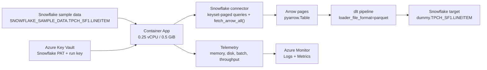

# dlthubarrow

Stress-test dlt's Arrow route on the smallest Azure Container Apps footprint:

- source: `SNOWFLAKE_SAMPLE_DATA.TPCH_SF{1,10,100,1000}.LINEITEM`
- destination: `dummy.TPCH_SF{1,10,100,1000}.LINEITEM`
- runtime: Azure Container Apps Consumption at `0.25 vCPU / 0.5 GiB`
- packaging: `uv`
- secrets: Azure Key Vault

The app extracts Snowflake result sets with Arrow batches, yields `pyarrow.Table` objects into dlt, and logs memory, disk, batch, and throughput metrics during the run.

## Flow



## Quick Start

### 1. Prerequisites

Install:

```bash
brew install azure-cli
brew install azure/azd/azd
brew install snowflake-cli
brew install uv
```

Authenticate once:

```bash
az login
azd auth login
snow connection add mpz
snow connection test -c mpz
```

The Snowflake CLI connection must be named `mpz`. The bootstrap script uses that name by default.

### 2. Bootstrap Snowflake

This creates the dedicated benchmark identity `AZAPP`, grants `AZAPP_ROLE`, prepares `dummy`, and creates a PAT.

```bash
./scripts/bootstrap_snowflake.sh
```

The last command prints a `token_secret`. Keep it outside the repo. You will use it for AZD environment values.

### 3. Create the AZD environment

```bash
azd env new swc
azd env set AZURE_SUBSCRIPTION_ID "<your-subscription-id>"
azd env set AZURE_LOCATION swedencentral
azd env set AZURE_RESOURCE_GROUP rg-dlthubarrow-swc

azd env set SOURCE_SNOWFLAKE_ACCOUNT "<your-snowflake-account>"
azd env set SOURCE_SNOWFLAKE_USER AZAPP
azd env set SOURCE_SNOWFLAKE_TOKEN "<azapp-pat>"
azd env set SOURCE_SNOWFLAKE_WAREHOUSE COMPUTE_WH
azd env set SOURCE_SNOWFLAKE_ROLE AZAPP_ROLE
azd env set SOURCE_SNOWFLAKE_DATABASE SNOWFLAKE_SAMPLE_DATA

azd env set DESTINATION_SNOWFLAKE_ACCOUNT "<your-snowflake-account>"
azd env set DESTINATION_SNOWFLAKE_USER AZAPP
azd env set DESTINATION_SNOWFLAKE_TOKEN "<azapp-pat>"
azd env set DESTINATION_SNOWFLAKE_WAREHOUSE COMPUTE_WH
azd env set DESTINATION_SNOWFLAKE_ROLE AZAPP_ROLE
azd env set DESTINATION_SNOWFLAKE_DATABASE dummy
```

### 4. Deploy

```bash
azd up --no-prompt
```

This provisions:

- Azure Container Registry
- Azure Key Vault
- Log Analytics
- Application Insights
- Azure Container Apps environment
- Azure Container App with a user-assigned managed identity

### 5. Trigger one benchmark run

```bash
./scripts/run_smoke_test.sh
```

### 6. Watch the app

Get the endpoint:

```bash
az containerapp show \
  --resource-group rg-dlthubarrow-swc \
  --name "$(azd env get-value CONTAINER_APP_NAME)" \
  --query properties.configuration.ingress.fqdn \
  --output tsv
```

Check the latest run state:

```bash
curl "https://$(az containerapp show \
  --resource-group rg-dlthubarrow-swc \
  --name "$(azd env get-value CONTAINER_APP_NAME)" \
  --query properties.configuration.ingress.fqdn \
  --output tsv)/latest"
```

Tail logs:

```bash
az containerapp logs show \
  --resource-group rg-dlthubarrow-swc \
  --name "$(azd env get-value CONTAINER_APP_NAME)" \
  --follow
```

## Why This Uses Arrow

The benchmark does not yield Python dict rows into dlt.

- Snowflake extraction uses keyset-paged SQL queries
- each page is fetched from Snowflake as Arrow with `fetch_arrow_all()`
- pages are normalized into `pyarrow.Table`
- the dlt resource yields those Arrow tables directly
- dlt loads with `loader_file_format="parquet"`

That matches the Arrow route described in the dlt article, with Arrow entering from the Snowflake connector rather than from dlt's SQL backend abstraction.

## TPCH_SF1 Result

Successful Azure run on the smallest Container Apps size:

| Metric | Value |
| --- | --- |
| Compute | `0.25 vCPU / 0.5 GiB` |
| Extracted rows | `6,001,215` |
| Loaded rows | `6,001,215` |
| Arrow pages / batches | `121` |
| dlt load packages | `1` |
| dlt jobs in package | `2` |
| Stage duration | `211.24s` |
| Throughput | `28,410 rows/s` |
| Source bytes | `165,228,544` |
| Effective throughput | `0.746 MB/s` |
| Peak in-app cgroup memory | `536,752,128 bytes` |
| Memory at stage completion | `282,013,696 bytes` |
| RSS at stage completion | `337,235,968 bytes` |
| Temp/work disk at stage completion | `241,966,510 bytes` |
| Replica restarts during TPCH_SF1 | `0` |

Azure Monitor view for the same window:

- max `MemoryPercentage`: `99%`
- max `WorkingSetBytes`: `318,771,200`
- max `CpuPercentage`: `62%`

Interpretation: `TPCH_SF1` completes on the smallest Container Apps footprint, but memory is still the limiting resource and the extraction phase runs very close to the container memory cap.

## Local Development

Install and run locally:

```bash
uv lock --python 3.12
uv sync --python 3.12 --dev
uv run python -m benchmark_runner
```

The app expects these environment variables when running locally:

- `RUN_API_KEY`
- `SOURCE_SNOWFLAKE_ACCOUNT`
- `SOURCE_SNOWFLAKE_USER`
- `SOURCE_SNOWFLAKE_PASSWORD`
- `DESTINATION_SNOWFLAKE_ACCOUNT`
- `DESTINATION_SNOWFLAKE_USER`
- `DESTINATION_SNOWFLAKE_PASSWORD`

Optional values:

- `SOURCE_SNOWFLAKE_WAREHOUSE`
- `SOURCE_SNOWFLAKE_ROLE`
- `SOURCE_SNOWFLAKE_DATABASE`
- `DESTINATION_SNOWFLAKE_WAREHOUSE`
- `DESTINATION_SNOWFLAKE_ROLE`
- `DESTINATION_SNOWFLAKE_DATABASE`
- `BENCHMARK_DATASETS`
- `BENCHMARK_SOURCE_TABLE`
- `BENCHMARK_SOURCE_CHUNK_ROWS`
- `BENCHMARK_WORK_ROOT`

## HTTP Endpoints

- `GET /healthz`
- `GET /latest`
- `POST /run`

`POST /run` requires the `X-Run-Key` header.

## Secret Safety

- Runtime secrets are stored in Azure Key Vault.
- `azd env` writes local values into `.azure/<env>/.env`, which is ignored by `.azure/.gitignore`.
- No PATs or passwords are committed in tracked files.
